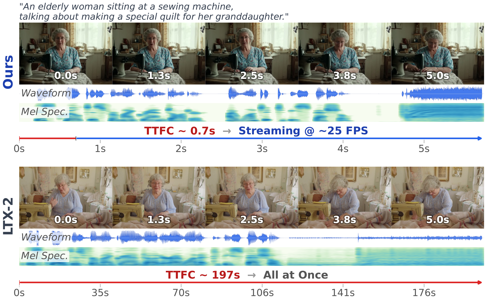
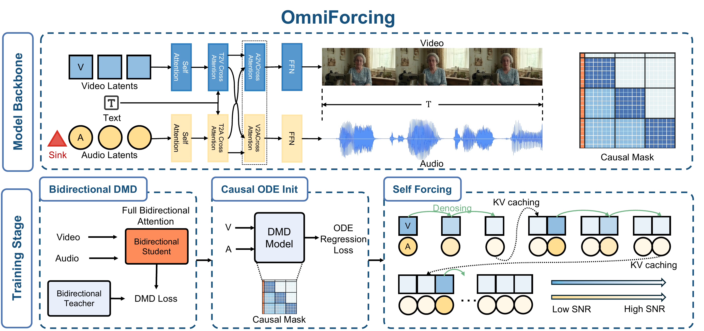
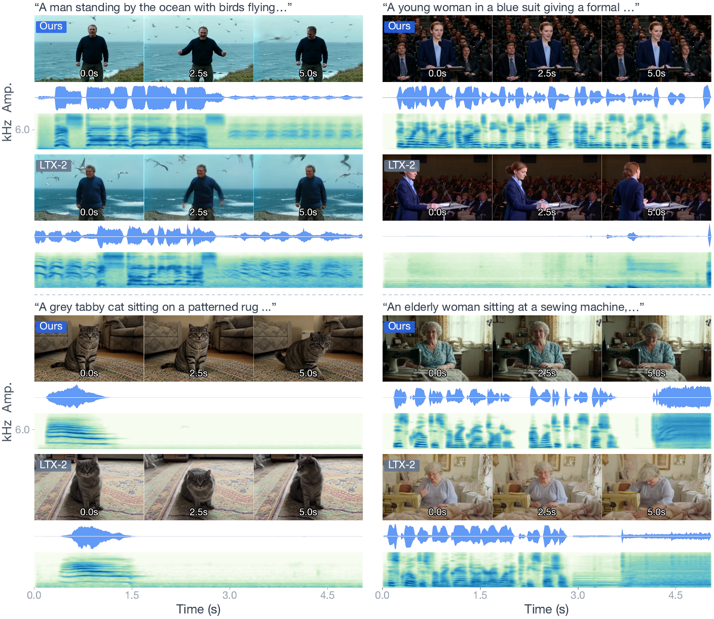

<div align="center">

# OmniForcing: Unleashing Real-time Joint Audio-Visual Generation



[Yaofeng Su]()\*<sup>1,2</sup>, [Yuming Li]()\*<sup>3</sup>, [Zeyue Xue]()<sup>1,4</sup>, [Jie Huang]()<sup>1</sup>, [Siming Fu]()<sup>1</sup>, [Haoran Li]()<sup>1</sup>, [Ying Li]()<sup>3</sup>, [Zezhong Qian]()<sup>3</sup>, [Haoyang Huang]()<sup>1</sup>, [Nan Duan]()<sup>1</sup>

\*Equal contribution &ensp;|&ensp; <sup>1</sup>JD Explore Academy &ensp; <sup>2</sup>Fudan University &ensp; <sup>3</sup>Peking University &ensp; <sup>4</sup>The University of Hong Kong

<a href="https://arxiv.org/abs/2603.11647"></a>
<a href="https://omniforcing.com"></a>

</div>

**OmniForcing** is the first framework to distill an offline, bidirectional joint audio-visual diffusion model into a **real-time streaming autoregressive generator**. Built on top of LTX-2 (14B video + 5B audio), OmniForcing achieves **~25 FPS** streaming on a single GPU with a Time-To-First-Chunk of only **~0.7s** -- a **~35x speedup** over the teacher -- while maintaining visual and acoustic fidelity on par with the bidirectional teacher model.


## News

- **[2026/03]** Training code and data processing pipeline open-sourced.
- **[2026/03]** Paper released on [arXiv 2603.11647](https://arxiv.org/abs/2603.11647). Project page is live at [OmniForcing.com](https://omniforcing.com).

> **Note:** The current implementation includes optimized mask designs compared to the paper. Support for LTX-2.3, improved inference pipeline, and future new work will be released soon.


## Method Overview

<div align="center">

</div>

OmniForcing employs a **three-stage distillation pipeline** to progressively transform the bidirectional teacher into a causal streaming engine:

- **Stage 1 -- Bidirectional DMD:** Distribution Matching Distillation compresses the multi-step diffusion sampling into few-step denoising, while preserving the original global attention.

- **Stage 2 -- Causal ODE Regression:** The model is equipped with our **Asymmetric Block-Causal Mask** and trained via ODE trajectory regression to adapt to causal attention. An **Audio Sink Token** mechanism with **Identity RoPE** is introduced to resolve the Softmax collapse and gradient explosion caused by extreme audio token sparsity.

- **Stage 3 -- Joint Self-Forcing DMD:** The model autoregressively unrolls its own generations during training, enabling dynamic self-correction of cumulative cross-modal errors from exposure bias. Two variants are provided:
  - **Self-Forcing DMD** (`main` branch): Autoregressive self-forcing rollout with DMD loss (recommended).
  - **Causal DMD** (`causal-dmd` branch): Block-wise DMD training without self-forcing rollout.

At inference time, a **Modality-Independent Rolling KV-Cache** reduces per-step context complexity to O(L) and enables concurrent execution of the video and audio streams, achieving real-time synchronized generation.

## Results & Demos

### Main Results on JavisBench

<div align="center">
<table>
<thead>
<tr>
<th>Model</th><th>Size</th><th>FVD ↓</th><th>FAD ↓</th><th>CLIP ↑</th><th>AV-IB ↑</th><th>DeSync ↓</th><th>Runtime ↓</th>
</tr>
</thead>
<tbody>
<tr><td>MMAudio</td><td>0.1B</td><td>--</td><td>6.1</td><td>--</td><td>0.198</td><td>0.849</td><td>15s</td></tr>
<tr><td>JavisDiT++</td><td>2.1B</td><td>141.5</td><td>5.5</td><td>0.316</td><td>0.198</td><td>0.832</td><td>10s</td></tr>
<tr><td>UniVerse-1</td><td>6.4B</td><td>194.2</td><td>8.7</td><td>0.309</td><td>0.104</td><td>0.929</td><td>13s</td></tr>
<tr><td>LTX-2 (Teacher)</td><td>19B</td><td><b>125.4</b></td><td><b>4.6</b></td><td>0.318</td><td><b>0.318</b></td><td><b>0.384</b></td><td>197s</td></tr>
<tr><td><b>OmniForcing (Ours)</b></td><td>19B</td><td>137.2</td><td>5.7</td><td><b>0.322</b></td><td>0.269</td><td>0.392</td><td><b>5.7s</b></td></tr>
</tbody>
</table>
</div>

### Distillation Fidelity (VBench)

<div align="center">
<table>
<thead>
<tr>
<th>Model</th><th>Aesthetic ↑</th><th>Imaging ↑</th><th>Motion Smooth. ↑</th><th>Subject Consist. ↑</th><th>TTFC ↓</th><th>FPS ↑</th>
</tr>
</thead>
<tbody>
<tr><td>LTX-2 (Teacher)</td><td>0.569</td><td>0.574</td><td>0.993</td><td>0.945</td><td>197.0s</td><td>--</td></tr>
<tr><td><b>OmniForcing</b></td><td><b>0.595</b></td><td><b>0.594</b></td><td><b>0.995</b></td><td><b>0.955</b></td><td><b>0.7s</b></td><td><b>25</b></td></tr>
</tbody>
</table>
</div>

### Demo Gallery

<div align="center">
<a href="https://omniforcing.com"></a>
<p><sub>Click the image above to watch audio-visual demos on our Project Page.</sub></p>
</div>


## Getting Started

### Prerequisites

- Python >= 3.10
- PyTorch >= 2.2.0
- 8x or 32x GPUs (A100/H100 recommended)

### Installation

```bash
git clone https://github.com/YourOrg/OmniForcing.git
cd OmniForcing/LTX-2

# Install packages (editable mode recommended)
pip install -e packages/ltx-core
pip install -e packages/ltx-pipelines
pip install -e packages/ltx-causal
pip install -e packages/ltx-distillation
```

### Download Models

Download the following pretrained models:

| Model | Description |
|-------|-------------|
| [ltx-2-19b-dev.safetensors](https://huggingface.co/Lightricks/LTX-Video-2) | LTX-2 base model (19B) |
| [gemma-3-12b-it-qat-q4_0-unquantized](https://huggingface.co/google/gemma-3-12b-it) | Gemma text encoder |

Update the paths in the config files to point to your downloaded models.


## Training Pipeline

The training follows a three-stage pipeline. We recommend **32 GPUs** (4 nodes x 8 GPUs) for optimal performance. You can also train with **8 GPUs** by setting `gradient_accumulation_steps: 4` in the config.

### Stage 1: Bidirectional DMD

Distills the LTX-2 teacher model from 1000-step to 4-step inference while preserving global attention.

**Data preparation:** Prepare a text prompts file (one prompt per line). You can use our prompt enhancement tools to expand short captions into detailed LTX-2 prompts:

```bash
# Option A: Using vLLM + any LLM (recommended)
cd LTX-2/packages/pe
# First start a vLLM server with your preferred LLM
# vllm serve /path/to/your/llm --tensor-parallel-size 8
python batch_enhance.py captions.txt --duration 5s

# Option B: Using local Gemma model
cd LTX-2/packages
python enhance_prompts.py --input captions.txt --output prompts.txt
```

**Training:**

```bash
cd LTX-2/packages/ltx-distillation

# Edit configs/stage1_bidirectional_dmd.yaml with your paths, then:
./scripts/train_stage1_bidirectional_dmd.sh

# Or specify config explicitly:
./scripts/train_stage1_bidirectional_dmd.sh configs/stage1_bidirectional_dmd.yaml
```

### Stage 2: Causal ODE Regression

Converts the bidirectional model to causal autoregressive using ODE trajectory regression. This stage requires generating ODE trajectory pairs from the Stage 1 teacher.

**Step 1: Generate ODE trajectory pairs**

```bash
cd LTX-2/packages/ltx-distillation

# Single GPU:
TEACHER_CHECKPOINT=/path/to/stage1_checkpoint/model.pt \
GEMMA_PATH=/path/to/gemma \
PROMPTS_FILE=/path/to/prompts.txt \
OUTPUT_DIR=./ode_pairs \
    ./scripts/generate_ode_pairs.sh

# Multi-node (faster):
NNODES=2 NODE_RANK=0 MASTER_ADDR=10.0.0.1 \
TEACHER_CHECKPOINT=/path/to/stage1_checkpoint/model.pt \
    ./scripts/generate_ode_pairs_multi_node.sh
```

**Step 2: Create LMDB dataset**

```bash
DATA_PATH=./ode_pairs LMDB_PATH=./ode_lmdb ./scripts/create_ode_lmdb.sh
```

**Step 3: Train**

```bash
# Edit configs/stage2_causal_ode.yaml with your paths, then:
./scripts/train_stage2_causal_ode.sh
```

### Stage 3: Causal DMD

Trains the causal autoregressive model with DMD loss using the ODE-initialized generator and bidirectional teacher/critic.

Two variants are available:

| Variant | Branch | Description |
|---------|--------|-------------|
| **Self-Forcing DMD** | `main` | Autoregressive self-forcing rollout with DMD loss (recommended) |
| **Causal DMD** | `causal-dmd` | Block-wise DMD training without self-forcing rollout |

**Training (Self-Forcing DMD, default):**

```bash
# Edit configs/stage3_causal_dmd.yaml with your paths, then:
./scripts/train_stage3_causal_dmd.sh
```

**Training (Causal DMD, alternative):**

```bash
git checkout causal-dmd
./scripts/train_stage3_causal_dmd.sh
```

### Hardware Recommendations

| Setup | GPUs | Config Change |
|-------|------|---------------|
| Recommended | 32 (4 nodes x 8) | Default settings |
| Minimum | 8 (1 node) | Set `gradient_accumulation_steps: 4` |

All training scripts auto-detect SLURM and multi-node environment variables. For multi-node training, set `NNODES`, `NODE_RANK`, and `MASTER_ADDR`.


## Repository Structure

```
OmniForcing/
├── README.md
├── static/                              # Demo images and videos
└── LTX-2/
    └── packages/
        ├── ltx-core/                    # Base model components (transformer, VAE, text encoder)
        ├── ltx-causal/                  # Causal wrapper, attention masks, block-causal architecture
        ├── ltx-distillation/            # Training pipeline
        │   ├── configs/
        │   │   ├── stage1_bidirectional_dmd.yaml
        │   │   ├── stage2_causal_ode.yaml
        │   │   └── stage3_causal_dmd.yaml
        │   ├── scripts/
        │   │   ├── train_stage1_bidirectional_dmd.sh
        │   │   ├── train_stage2_causal_ode.sh
        │   │   ├── train_stage3_causal_dmd.sh
        │   │   ├── generate_ode_pairs.sh
        │   │   ├── generate_ode_pairs_multi_node.sh
        │   │   └── create_ode_lmdb.sh
        │   └── src/ltx_distillation/
        │       ├── train_distillation.py    # DMD training loop (Stages 1 & 3)
        │       ├── dmd.py                   # DMD model, loss, generator/critic
        │       ├── ode/                     # ODE regression (Stage 2)
        │       │   ├── train_ode.py
        │       │   ├── generate_ode_pairs.py
        │       │   └── create_lmdb.py
        │       ├── inference/               # Benchmark pipelines
        │       └── models/                  # Model wrappers
        ├── ltx-pipelines/               # Inference pipeline utilities
        ├── pe/                          # Prompt enhancement (vLLM-based)
        └── enhance_prompts.py           # Prompt enhancement (API-based)
```


## Citation

If you find OmniForcing useful in your research, please consider citing:

```bibtex
@article{su2026omniforcing,
  title   = {OmniForcing: Unleashing Real-time Joint Audio-Visual Generation},
  author  = {Su, Yaofeng and Li, Yuming and Xue, Zeyue and Huang, Jie and Fu, Siming
             and Li, Haoran and Li, Ying and Qian, Zezhong and Huang, Haoyang and Duan, Nan},
  journal = {arXiv preprint arXiv:2603.11647},
  year    = {2026}
}
```

## Acknowledgements

OmniForcing builds upon several outstanding works. We thank the authors of [LTX-2](https://github.com/Lightricks/LTX-2), [Self-Forcing](https://github.com/guandeh17/Self-Forcing), [CausVid](https://github.com/tianweiy/CausVid), and [DMD](https://github.com/tianweiy/DMD2) for their pioneering contributions.
